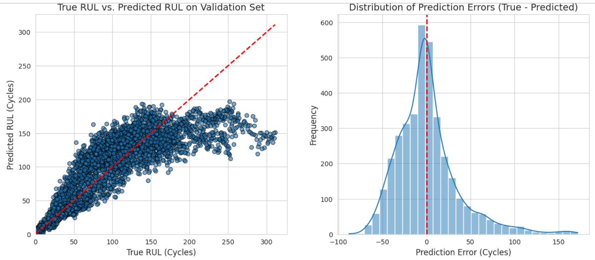
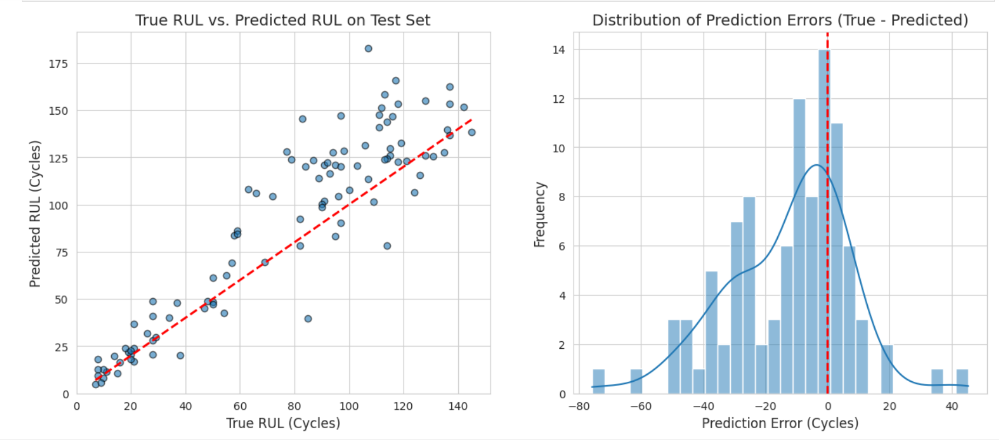
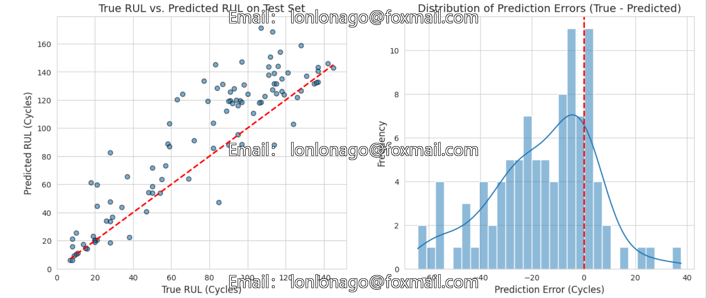
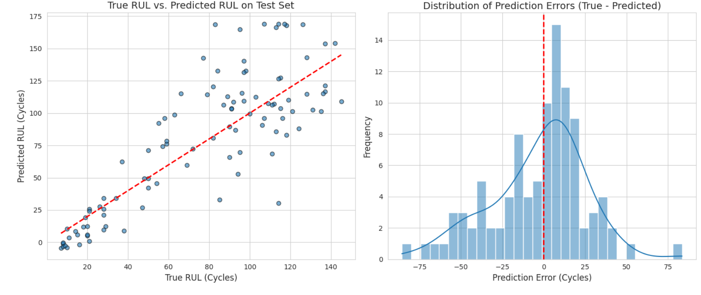

# Predicting the Remaining Lifespan of Aviation Engines Based on Machine Learning and Deep Learning (C-MAPSS Data Set, Python)

LightGBM Method
Random Forest Method
Transformer Method

## Image

Here is a pay link on Stripe ( https://buy.stripe.com/3cs8yP7sY87d0vu9AB ). Please contact me lonlonago@foxmail.com after funding $89, and I will send you a complete data files , thank you!

